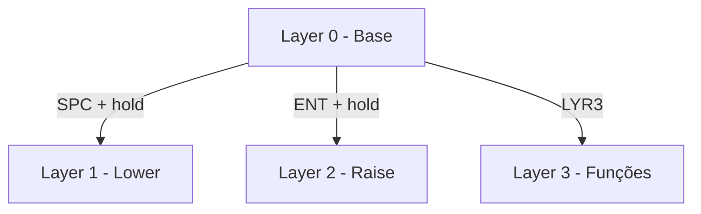

# Configuração ZMK para Corne Wireless

Este é um fork personalizado da configuração ZMK para o teclado Corne Wireless, otimizado para uso em português e com várias melhorias de qualidade de vida.

## Sumário
- [Quick Start](#quick-start)
- [Hardware Suportado](#hardware-suportado)
- [Características](#características)
- [Layers e Layout](#layers-e-layout)
- [Combos e Atalhos](#combos-e-atalhos)
- [Suporte ao Português](#suporte-ao-português)
- [Configuração e Instalação](#configuração-e-instalação)
- [Personalização](#personalização)
- [Troubleshooting](#troubleshooting)
- [Contribuindo](#contribuindo)
- [Changelog](#changelog)
- [Créditos](#créditos)

## Quick Start

1. **Download do Firmware**
   ```bash
   git clone https://github.com/seu-usuario/corne-zmk
   cd corne-zmk
   ```

2. **Flash Rápido**
   - Pressione reset 2x no Nice!Nano
   - Copie o arquivo .uf2 correspondente
   - Pronto para usar!

3. **Primeiros Passos**
   - Use `SPC` + `hold` para Layer 1 (números)
   - Use `ENT` + `hold` para Layer 2 (navegação)
   - Use `LYR3` para Layer 3 (funções)

---

## Hardware Suportado

- Controlador: Nice!Nano v2
- Display: Suporte para OLED e Nice!View
- RGB Underglow (opcional)
- Switches: Suporte para qualquer switch MX

### Configurações Recomendadas por Sistema Operacional

| Sistema | Bluetooth | Sleep Timer | RGB Mode |
|---------|-----------|-------------|----------|
| Windows | Profile 1 | 30 min | Breathing |
| macOS   | Profile 2 | 45 min | Static |
| Linux   | Profile 3 | 60 min | Rainbow |

---

## Características

- Layout otimizado para português com suporte a acentos
- 4 layers com funções específicas
- Combos intuitivos para caracteres especiais
- Tap dance para acentuação
- Macros para palavras comuns
- Controles de mídia e RGB
- Otimizações de energia para maior duração da bateria

### Diagrama de Acesso às Layers



---

## Layers e Layout

### Layer Base (0) `[DEFAULT]`
- Layout QWERTY padrão
- Modificadores nas teclas home row
- Acesso aos outros layers através de hold

```
,-----------------------------------------------.                    ,-----------------------------------------------.
|  TAB  |   Q   |   W   |   E   |   R   |   T   |                    |   Y   |   U   |   I   |   O   |   P   |  BKSP |
|-------+-------+-------+-------+-------+-------|                    |-------+-------+-------+-------+-------+-------|
|  CTRL | A/GUI | S/ALT | D/CTL | F/SFT |   G   |                    |   H   | J/SFT | K/CTL | L/ALT | ;/GUI |   '   |
|-------+-------+-------+-------+-------+-------|                    |-------+-------+-------+-------+-------+-------|
|  SHFT |   Z   |   X   |   C   |   V   |   B   |                    |   N   |   M   |   ,   |   .   |   /   |  ESC  |
`-------+-------+-------+-------+-------+-------'                    `-------+-------+-------+-------+-------+-------'
                        |  TAB  | SPC/1 | ENT/2 |                    |  LYR3  | BKSP/2 |  BKSP |
                        `-----------------------'                    `-------------------------'
```

### Layer Lower (1) `[NUMBERS]`
- Números
- Símbolos básicos
- Controles do sistema

```
,-----------------------------------------------.                    ,-----------------------------------------------.
|  TAB  |   1   |   2   |   3   |   4   |   5   |                    |   6   |   7   |   8   |   9   |   0   | BKSP  |
|-------+-------+-------+-------+-------+-------|                    |-------+-------+-------+-------+-------+-------|
| BOOT  | RGB_T |       |       |       |  F12  |                    |   -   |   =   |   `   |       |   '   |       |
|-------+-------+-------+-------+-------+-------|                    |-------+-------+-------+-------+-------+-------|
|  PWR  |       |       |       |       |       |                    |       |       |       |       |       |       |
`-------+-------+-------+-------+-------+-------'                    `-------+-------+-------+-------+-------+-------'
                        |       |       |       |                    |       | SHFT  |       |
                        `-----------------------'                    `-----------------------'
```

### Layer Raise (2) `[NAVIGATION]`
- Teclado numérico
- Navegação (setas)
- Controles do cursor

```
,-----------------------------------------------.                    ,-----------------------------------------------.
|       |  ESC  |   7   |   8   |   9   |   0   |                    | HOME  |       |  UP   |       |       |       |
|-------+-------+-------+-------+-------+-------|                    |-------+-------+-------+-------+-------+-------|
|       | CAPS  |   4   |   5   |   6   |   @   |                    | END   | LEFT  | DOWN  | RGHT  |       |       |
|-------+-------+-------+-------+-------+-------|                    |-------+-------+-------+-------+-------+-------|
|       |  DEL  |   1   |   2   |   3   |   .   |                    |       |       |       |       |       |       |
`-------+-------+-------+-------+-------+-------'                    `-------+-------+-------+-------+-------+-------'
                        |       |       |       |                    |       |       |       |
                        `-----------------------'                    `-----------------------'
```

### Layer Funções (3) `[FUNCTION]`
- Controles Bluetooth
- Teclas de função (F1-F12)
- Controles de mídia
- Ajustes RGB

```
,-----------------------------------------------.                    ,-----------------------------------------------.
|       |  BT1  |  BT2  |  BT3  |  BT4  | BTCLR |                    |  F1   |  F2   |  F3   |  F4   |  F5   |  F6   |
|-------+-------+-------+-------+-------+-------|                    |-------+-------+-------+-------+-------+-------|
| RGB_T | RGB_HI| RGB_SI| RGB_BI| RGB_SP| RGB_EF|                    |  F7   |  F8   |  F9   |  F10  |  F11  |  F12  |
|-------+-------+-------+-------+-------+-------|                    |-------+-------+-------+-------+-------+-------|
| RGB_EF| RGB_HD| RGB_SD| RGB_BD| RGB_SP| RGB_ON|                    |       |       |       |       |       |       |
`-------+-------+-------+-------+-------+-------'                    `-------+-------+-------+-------+-------+-------'
                        |       |       |       |                    |       |       |       |
                        `-----------------------'                    `-----------------------'
```

---

## Combos e Atalhos

### Combos Rápidos
| Combo | Função | Uso Comum |
|-------|---------|-----------|
| `Q + W` | ESC | Sair de modos |
| `K + L` | Enter | Confirmar ação |
| `E + D` | Ç | Cedilha |
| `[ ]` | Colchetes | Arrays, listas |
| `( )` | Parênteses | Funções, expressões |
| `{ }` | Chaves | Blocos de código |
| `\ |` | Barra/Pipe | Comandos shell |

### Tap Dance
| Tecla | Sequência | Uso |
|-------|-----------|-----|
| `A` | a → á → â | Acentuação |
| `E` | e → é → ê | Acentuação |

---

## Suporte ao Português

### Acentuação Rápida
| Tecla | Acento | Exemplo |
|-------|---------|---------|
| `A` 2x | á | café |
| `A` 3x | â | câmara |
| `E` 2x | é | época |
| `E` 3x | ê | você |

### Caracteres Especiais
- Ç: `E + D`
- À: `A + Q`
- Ã: `A + N`

### Macros Comuns
- `cao`: automatically types "ção"
- `voce`: automatically types "você"

---

## Dicas de Uso

### Workflows Comuns
1. **Programação**
   - Use Layer 2 para navegação no código
   - Combos para símbolos de programação
   - Tap dance para comentários

2. **Escrita em Português**
   - Tap dance para acentos comuns
   - Macros para terminações frequentes
   - Combos para pontuação

3. **Controle de Sistema**
   - Layer 3 para controles Bluetooth
   - RGB para feedback visual
   - Atalhos de mídia rápidos

---

## Personalização Avançada

### Ajustes de Tap Dance
```c
&td_a {
    tapping-term-ms = <200>;
    bindings = <&kp A>, <&kp RA(A)>, <&kp LS(RA(A))>;
}
```

### Configurações RGB
```c
CONFIG_ZMK_RGB_UNDERGLOW_BRT_START=30
CONFIG_ZMK_RGB_UNDERGLOW_BRT_MAX=60
CONFIG_ZMK_RGB_UNDERGLOW_EFF_START=3
```

### Otimizações de Energia
```c
CONFIG_ZMK_IDLE_TIMEOUT=1800000      // 30 minutos
CONFIG_ZMK_SLEEP=y
CONFIG_ZMK_IDLE_SLEEP_TIMEOUT=2700000 // 45 minutos
```

---

## Changelog

### v1.0.0 (2024-03-XX)
- Configuração inicial
- Suporte a português
- 4 layers básicas

### v1.1.0 (Em desenvolvimento)
- [ ] Mais macros em português
- [ ] Melhorias no RGB
- [ ] Novos combos

---

## Configuração e Instalação

1. Fork este repositório
2. Faça suas modificações (opcional)
3. A GitHub Action irá compilar automaticamente
4. Baixe os arquivos .uf2 gerados

## Como Flashear

1. Pressione o botão reset duas vezes no Nice!Nano
2. O teclado aparecerá como dispositivo USB "NICENANO"
3. Copie o arquivo .uf2 correspondente:
   - `corne_left_xxx-nice_nano_v2-zmk.uf2` para o lado esquerdo
   - `corne_right_xxx-nice_nano_v2-zmk.uf2` para o lado direito

## Troubleshooting

### Problemas de Conexão Bluetooth
1. Use o arquivo `settings_reset-nice_nano_v2-zmk.uf2`
2. Flashe novamente o firmware normal
3. Pareie novamente os dispositivos

### Problemas de Bateria
- Verifique se o RGB está configurado para desligar quando inativo
- Ajuste os tempos de idle e sleep no arquivo `corne.conf`

### Problemas de Sincronização
- Certifique-se de que ambos os lados estão com bateria
- Reset as configurações Bluetooth se necessário
- Verifique se está usando a mesma versão do firmware em ambos os lados

## Customização

Para personalizar sua configuração:
1. Modifique `corne.keymap` para alterar o layout
2. Ajuste `corne.conf` para configurações do sistema
3. Commit as alterações e deixe a Action compilar

## Contribuindo

Sinta-se livre para:
1. Abrir issues para reportar problemas
2. Enviar pull requests com melhorias
3. Compartilhar suas customizações

## Créditos

- ZMK Firmware: [zmkfirmware.dev](https://zmkfirmware.dev)
- Corne Keyboard: [foostan/crkbd](https://github.com/foostan/crkbd)
- Base config: [ZMK Config](https://github.com/zmkfirmware/zmk-config)

---

Made by [the spanish guy](https://github.com/the-spanish-guy) with :black_heart:

```
          ／＞　 フ
         | 　_　_|
       ／` ミ__^ノ
      /　　　　 |
     /　 ヽ　　 ﾉ           ╱|、
    /　　 |　|　|         (˚ˎ 。7
／￣|　　 |　|　|          |、˜〵
(￣ヽ＿_  ヽ_)__)         じしˍ,)ノ
＼二)
```
